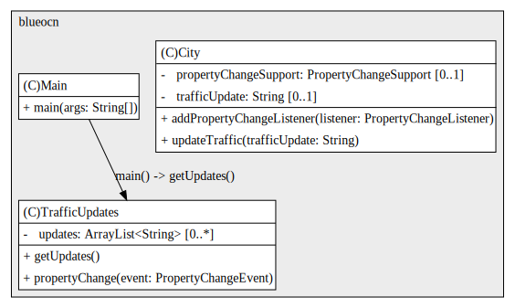

## Java Design Patterns: Behavioral

---

# Challenge
Let's have a look at our first exercise. In this one, you're going to be refactoring an app that posts traffic updates for various cities. So let's have a look at the code so far. First of all, there is a class called City, which has a string field called trafficUpdate. And a method called updateTraffic to update that field. This class is going to be the observable. Then there's a class called TrafficUpdates, which is going to be the observer. This has an array list of strings called updates and a method called getUpdates, which prints out every update in the list. 

Finally, there is a Main class with a main method. In here, I'm creating two City objects, sunnyville and springfield. And I'm creating a trafficUpdates class and then I'm updating the traffic for both cities. So in Sunnyville, there is congestion in the town center and in Springfield, there's an accident on the highway. Then I'm calling trafficUpdates.getUpdates. If I run the app at the moment, nothing happens. So this exercise is to refactor this app to use the observer pattern so that trafficUpdates knows when a city posts a traffic update. This is very similar to the example I showed in the previous videos. So if you get stuck, I'd recommend going back and watching them again. I'm estimating this will take you about 20 minutes. So good luck and have fun.

# Solution

This UML diagram illustrates a classic Observer pattern implementation using Java’s PropertyChangeSupport. The City class plays the role of the Subject. It holds a trafficUpdate field and a PropertyChangeSupport instance to manage listeners.

When updateTraffic() is called, it triggers a property change event, notifying all registered observers. TrafficUpdates acts as the Observer, implementing propertyChange() to respond to updates from City. It stores received updates in an internal list and exposes them via getUpdates()

The Main class serves as the entry point, where instances of City and TrafficUpdates are created. It registers TrafficUpdates as a listener to one or more City objects and invokes traffic updates.

This setup allows cities to broadcast changes without knowing who’s listening, while observers react automatically. The Observer pattern here provides decoupled communication, dynamic subscription, and a scalable way to propagate state changes across components.